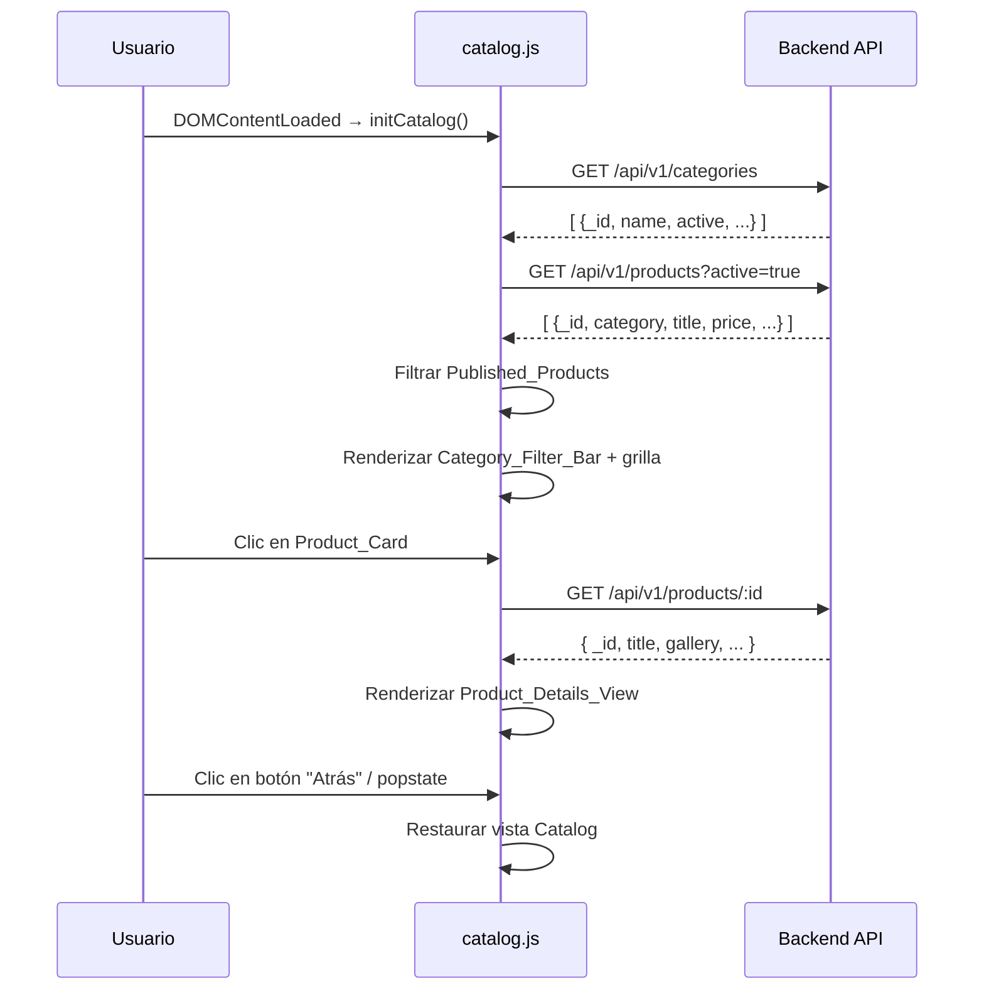

# Documento de Diseño: Catálogo de Inventario con Filtro por Categoría y Vista de Detalle

## Visión General

Esta funcionalidad reemplaza la sección estática `#shop` de `index.html` con un catálogo dinámico que consume la API del backend. El módulo `catalog.js` se encarga de obtener categorías y productos, renderizar una barra de filtros por categoría (`Category_Filter_Bar`), mostrar los productos en una grilla de tarjetas (`Product_Card`) y navegar a una vista de detalle completa (`Product_Details_View`) en modo SPA, sin cambiar de página.

El stack es Vanilla JavaScript (ES modules), HTML5, CSS3 y Vite 6. El backend es Node.js/Express con MongoDB.

### Decisiones de diseño clave

- **Sin framework**: toda la manipulación del DOM es directa (`createElement`, `innerHTML`, `classList`), coherente con el resto del sitio.
- **Módulo único `catalog.js`**: toda la lógica del catálogo se encapsula en un solo archivo importado desde `main.js`, sin crear dependencias adicionales.
- **Filtrado en el cliente**: los productos se obtienen una sola vez y el filtrado por categoría se realiza en memoria, evitando peticiones adicionales al backend al cambiar de categoría.
- **SPA-style con `hashchange`/`popstate`**: la navegación al detalle actualiza el hash de la URL (`#product-details`) para soportar el botón "atrás" del navegador sin recargar la página.
- **Endpoint `GET /api/v1/products/:id` nuevo**: el detalle del producto requiere un endpoint público que aún no existe en el backend; se añade como parte de esta funcionalidad.

---

## Arquitectura

```
index.html
  └── main.js  (DOMContentLoaded)
        └── catalog.js  (initCatalog)
              ├── API Client  (fetchCategories, fetchProducts, fetchProductById)
              ├── State       (categories[], products[], activeFilter, currentProduct)
              ├── Renderer    (renderFilterBar, renderProductGrid, renderProductDetails)
              └── Navigation  (showCatalog, showProductDetails, popstate handler)
```



---

## Componentes e Interfaces

### `catalog.js` — API pública

```js
// Punto de entrada, llamado desde main.js dentro de DOMContentLoaded
export function initCatalog()
```

### Funciones internas

| Función | Responsabilidad |
|---|---|
| `fetchCategories()` | GET `/api/v1/categories` → `Promise<Category[]>` |
| `fetchProducts()` | GET `/api/v1/products?active=true` → `Promise<Product[]>` |
| `fetchProductById(id)` | GET `/api/v1/products/:id` → `Promise<Product>` |
| `filterPublished(products)` | Filtra por `active === true` y `dateEndPublish` nulo o futuro |
| `groupByCategory(products, categories)` | Agrupa productos por `category` name |
| `renderFilterBar(categories, products)` | Renderiza los botones de filtro en el DOM |
| `renderProductGrid(products)` | Renderiza la grilla de `Product_Card` |
| `renderProductDetails(product)` | Renderiza el `Product_Details_View` |
| `showCatalog()` | Muestra la vista catálogo, oculta el detalle |
| `showProductDetails(id)` | Llama al API, renderiza detalle, actualiza hash |
| `setActiveFilter(categoryName)` | Actualiza el filtro activo y re-renderiza la grilla |
| `formatPrice(price)` | Formatea precio como USD o devuelve "Consultar precio" |
| `renderSkeleton()` | Muestra skeleton/spinner mientras carga |
| `renderError(message)` | Muestra mensaje de error en `#shop` |

### Integración con `main.js`

```js
// main.js — dentro del listener DOMContentLoaded existente
import { initCatalog } from './catalog.js';

document.addEventListener('DOMContentLoaded', () => {
  initSlideshow();
  initMobileMenu();
  initSmoothScroll();
  initNavbarScroll();
  initActiveNavLink();
  initContactForm();
  initFooterYear();
  initCatalog(); // ← nueva línea
});
```

### Nuevo endpoint backend: `GET /api/v1/products/:id`

Se añade en `backend/routes/products.routes.js` (ruta pública, sin `authMiddleware`) y en `backend/controllers/products.controller.js`:

```js
// Controller
export async function getProductById(req, res) {
  try {
    const product = await Product.findById(req.params.id)
    if (!product) return res.status(404).json({ message: 'Producto no encontrado' })
    res.json(product)
  } catch (err) {
    if (err.name === 'CastError') {
      return res.status(400).json({ message: 'ID de producto inválido' })
    }
    res.status(500).json({ message: 'Error al obtener producto', error: err.message })
  }
}
```

```js
// Route (pública, antes de las rutas protegidas)
router.get('/:id', getProductById)
```

---

## Modelos de Datos

### `Category` (existente en MongoDB)

```ts
{
  _id: string          // MongoDB ObjectId
  name: string         // Nombre de la categoría (usado como clave de agrupación)
  description?: string
  active: boolean      // Solo se muestran las activas
  dateCreation?: string
  createdBy?: string
}
```

### `Product` (existente en MongoDB)

```ts
{
  _id: string
  category: string     // Coincide con Category.name
  title: string
  description?: string
  price: number | null // null → "Consultar precio"
  discount: number     // 0 = sin descuento; > 0 = mostrar badge
  image?: string       // URL imagen principal; null/vacío → placeholder
  gallery?: string[]   // URLs imágenes secundarias
  quantity: number
  priority: number     // Orden descendente en la grilla
  dateEndPublish?: string | null  // null o fecha ISO; si es pasada → excluir
  active: boolean
  dateCreation?: string
  createdBy?: string
}
```

### Estado interno de `catalog.js`

```js
const state = {
  categories: [],       // Category[] — solo activas
  products: [],         // Product[] — Published_Products
  activeFilter: 'all',  // 'all' | category.name
  currentProduct: null, // Product | null — producto en detalle
}
```

### `Published_Product` — criterio de inclusión

Un producto es un `Published_Product` si y solo si:
1. `product.active === true`
2. `product.dateEndPublish === null` **O** `new Date(product.dateEndPublish) > new Date()`

---

## Propiedades de Corrección

*Una propiedad es una característica o comportamiento que debe mantenerse verdadero en todas las ejecuciones válidas del sistema — esencialmente, una declaración formal sobre lo que el sistema debe hacer. Las propiedades sirven como puente entre las especificaciones legibles por humanos y las garantías de corrección verificables por máquina.*

### Propiedad 1: Filtrado de categorías activas

*Para cualquier* array de categorías con valores `active` arbitrarios, el catálogo renderizado debe contener únicamente las categorías cuyo campo `active` sea `true`.

**Valida: Requisito 1.2**

---

### Propiedad 2: Filtrado de Published_Products

*Para cualquier* array de productos con valores arbitrarios de `active` y `dateEndPublish`, el catálogo debe incluir únicamente los productos donde `active === true` y (`dateEndPublish` es nulo o es una fecha futura respecto al momento de la evaluación).

**Valida: Requisitos 2.2, 2.4**

---

### Propiedad 3: Asociación producto–categoría

*Para cualquier* conjunto de productos y categorías, cada producto renderizado en la grilla de una categoría debe tener su campo `category` igual al `name` de esa categoría.

**Valida: Requisito 2.3**

---

### Propiedad 4: Category_Filter_Bar refleja categorías con productos publicados

*Para cualquier* conjunto de categorías activas y productos publicados, los botones de la `Category_Filter_Bar` (excluyendo "Todos") deben corresponder exactamente al conjunto de categorías que tienen al menos un `Published_Product` asociado — ni más ni menos.

**Valida: Requisitos 3.1, 3.8**

---

### Propiedad 5: "Todos" es siempre el primer botón del filtro

*Para cualquier* conjunto de datos del catálogo (incluyendo cero categorías con productos), el primer elemento de la `Category_Filter_Bar` debe ser el botón "Todos".

**Valida: Requisito 3.2**

---

### Propiedad 6: Filtrado por categoría muestra solo sus productos

*Para cualquier* clic en un botón de categoría de la `Category_Filter_Bar`, la grilla debe contener únicamente los `Published_Products` cuyo campo `category` coincida con el nombre de la categoría seleccionada.

**Valida: Requisitos 3.4, 3.6**

---

### Propiedad 7: Solo un botón de filtro tiene el estilo activo

*Para cualquier* estado del `Active_Category_Filter`, exactamente un botón de la `Category_Filter_Bar` debe tener la clase CSS activa; todos los demás deben carecer de ella.

**Valida: Requisito 3.5**

---

### Propiedad 8: Orden de productos por prioridad descendente

*Para cualquier* conjunto de productos renderizados en la grilla, el orden de aparición debe ser descendente según el campo `priority` (mayor `priority` primero).

**Valida: Requisito 3.7**

---

### Propiedad 9: Product_Card contiene todos los campos requeridos

*Para cualquier* producto publicado, su `Product_Card` renderizada debe contener: imagen principal (o placeholder si es nula), título, precio formateado (o "Consultar precio" si es nulo), badge de descuento (si `discount > 0`), e indicador de categoría.

**Valida: Requisitos 4.1, 4.2, 4.3, 4.4, 4.5**

---

### Propiedad 10: Formato de precio USD

*Para cualquier* valor numérico positivo de `price`, la función `formatPrice` debe devolver una cadena con formato de moneda USD (símbolo `$`, dos decimales).

**Valida: Requisito 4.3**

---

### Propiedad 11: Clic en Product_Card navega al detalle correcto

*Para cualquier* `Product_Card` en la grilla, al hacer clic sobre ella, el `Product_Details_View` debe renderizarse con los datos del producto correspondiente a esa tarjeta.

**Valida: Requisito 4.6**

---

### Propiedad 12: Product_Details_View contiene todos los campos requeridos

*Para cualquier* producto obtenido del endpoint `/api/v1/products/:id`, el `Product_Details_View` renderizado debe contener: imagen principal destacada, título, descripción, categoría, precio (o "Consultar precio"), descuento destacado (si `discount > 0`), cantidad disponible, estado activo, fecha de creación, y opcionalmente `createdBy` y `dateEndPublish` si existen.

**Valida: Requisitos 5.2, 5.3, 5.4, 5.9**

---

### Propiedad 13: Clic en miniatura de galería reemplaza imagen principal

*Para cualquier* producto con un campo `gallery` no vacío, al hacer clic en cualquier miniatura de la galería, la `src` de la imagen principal del `Product_Details_View` debe actualizarse a la URL de la miniatura seleccionada.

**Valida: Requisito 5.5**

---

### Propiedad 14: Navegación de vuelta restaura el catálogo

*Para cualquier* estado del `Product_Details_View` activo, al hacer clic en el botón de retorno (o al dispararse el evento `popstate`), el `Product_Details_View` debe ocultarse y la vista del catálogo debe restaurarse al estado previo (mismo filtro activo, misma grilla).

**Valida: Requisitos 5.7, 6.6**

---

### Propiedad 15: Hash de URL se actualiza al abrir el detalle

*Para cualquier* producto cuyo detalle sea abierto, `window.location.hash` debe ser `#product-details` mientras el `Product_Details_View` está activo.

**Valida: Requisito 6.5**

---

## Manejo de Errores

| Escenario | Comportamiento |
|---|---|
| Fallo en `GET /api/v1/categories` | Mostrar mensaje de error en `#shop`: "No fue posible cargar el inventario. Intenta de nuevo más tarde." |
| Sin categorías activas | Mostrar mensaje informativo: "No hay categorías disponibles en este momento." |
| Fallo en `GET /api/v1/products` | Mostrar mensaje de error en `#shop` |
| Fallo en `GET /api/v1/products/:id` | Mostrar mensaje de error dentro del `Product_Details_View` |
| `id` con formato inválido (backend) | Backend responde 400; frontend muestra mensaje de error en el detalle |
| `id` no encontrado (backend) | Backend responde 404; frontend muestra mensaje de error en el detalle |
| Producto sin imagen | Mostrar imagen placeholder (URL de imagen genérica o SVG inline) |
| Producto sin precio | Mostrar texto "Consultar precio" |

Todos los mensajes de error son visibles al usuario en la sección correspondiente del DOM. No se lanzan excepciones no capturadas al contexto global.

---

## Estrategia de Testing

### Enfoque dual

Se combinan **tests de ejemplo** (casos concretos) y **tests de propiedad** (cobertura universal con entradas generadas aleatoriamente).

### Librería de property-based testing

Se usará **[fast-check](https://fast-check.dev/)** para JavaScript, configurado con un mínimo de **100 iteraciones** por propiedad.

```bash
npm install --save-dev fast-check vitest
```

### Tests de propiedad (fast-check)

Cada test de propiedad referencia su propiedad de diseño con el tag:
`Feature: inventory-product-catalog, Property N: <texto>`

| Propiedad | Descripción del test |
|---|---|
| P1 | Generar arrays de categorías con `active` aleatorio; verificar que solo las activas aparecen en el DOM |
| P2 | Generar arrays de productos con `active` y `dateEndPublish` aleatorios; verificar que solo los Published_Products se incluyen |
| P3 | Generar productos y categorías; verificar que cada producto renderizado en una categoría tiene el `category` correcto |
| P4 | Generar datos del catálogo; verificar que los botones del filtro coinciden exactamente con las categorías con productos publicados |
| P5 | Generar cualquier dato de catálogo; verificar que el primer botón es siempre "Todos" |
| P6 | Generar datos y simular clic en categoría aleatoria; verificar que la grilla solo muestra productos de esa categoría |
| P7 | Simular clic en cualquier botón de filtro; verificar que exactamente uno tiene la clase activa |
| P8 | Generar productos con `priority` aleatorio; verificar orden descendente en el DOM |
| P9 | Generar productos con campos opcionales nulos/presentes; verificar que la `Product_Card` contiene todos los elementos requeridos |
| P10 | Generar precios positivos aleatorios; verificar formato USD de `formatPrice` |
| P11 | Simular clic en cualquier tarjeta; verificar que el detalle muestra el producto correcto |
| P12 | Generar productos con campos opcionales variados; verificar que el `Product_Details_View` contiene todos los campos requeridos |
| P13 | Generar productos con galerías de longitud aleatoria; simular clic en miniatura aleatoria; verificar que la imagen principal cambia |
| P14 | Navegar al detalle y simular retorno; verificar que el catálogo se restaura |
| P15 | Abrir detalle de cualquier producto; verificar `window.location.hash === '#product-details'` |

### Tests de ejemplo (Vitest)

- Carga inicial: verificar que `fetch` se llama con las URLs correctas en el orden correcto
- Estado inicial: "Todos" activo, todos los productos visibles
- Indicador de carga: skeleton visible antes de que `fetch` resuelva
- Reemplazo del contenido estático: las tarjetas hardcodeadas ya no están en el DOM tras `initCatalog()`
- Módulo importable: `import { initCatalog } from './catalog.js'` no lanza errores

### Tests de integración (backend)

- `GET /api/v1/products/:id` con ObjectId válido existente → 200 + objeto completo
- `GET /api/v1/products/:id` con ObjectId válido inexistente → 404
- `GET /api/v1/products/:id` con formato inválido → 400

### Cobertura de edge cases (incluidos en los generadores de fast-check)

- Producto con `price: null`
- Producto con `discount: 0` y `discount > 0`
- Producto con `image: null` o `image: ""`
- Producto con `gallery: []` o `gallery: null`
- Producto con `dateEndPublish` en el pasado, en el futuro, y nulo
- Categoría activa sin productos publicados
- Array vacío de categorías activas
